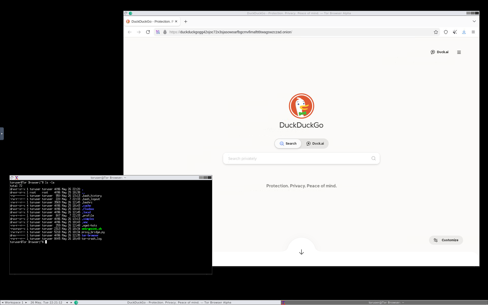

# Safe Tor Brower

Run a Tor Browser toghether with a SOCKS proxy instance within a containerised environment.



# Run

Set your own password by passing an env variable `export VNC_PASSWORD=MySuperSecurePassword` or leave it empty to auto-generate it.

If the password is auto-generated, you need to run `docker compose logs tor-browser` to view your password.

```bash
make up
```

alternatively

```bash
docker compose up --build -d
```

Visit `http://10.9.0.1:5800` on your browser.
If you want to rescale the size of the window visit: `http://10.9.0.1:5800/?resize=scale`

### Check logs

```bash
make logs
```

alternatively

```bash
docker logs tor-browser -f
```

### Cleanup:

```bash
make down
```

alternatively

```bash
docker compose down
```

## Launch apps within container

1. Right click on black background
2. Launch `Tor Browser` or `XTerm`

## List supported env variables

- `HOST_ADDRESS` -> change listening host address, default is `127.0.0.1`
- `VNC_PASSWORD` -> set custom password to access vnc. Default is randomly generated.
- `EXPOSE_PROXY` -> by default is set to `true`. `SOCKS` proxy will be available on port `5801`

## Advanced usages

A port `5801` is also forwarded and allows the use of the `tor-browser` backend programmatically. To open the port and make the proxy up you need to have run the container using the environment variable `EXPOSE_PROXY` set to `true`.


> [!IMPORTANT]
> Using tor SOCKS proxy needs tor-browser to be connected to the tor network. By default it is not connect, so you should login via VNC, connect the browser and then you can use the proxied tor.

### Example usage

Having `tor-browser` within the container connected to the Tor network, use it like:

```bash
curl -sS --socks5-hostname toruser:SOCKS_PASSWORD@127.0.0.1:5801 https://check.torproject.org/api/ip | jq

{
  "IsTor": true,
  "IP": "45.84.107.97"
}
```

Where `SOCKS_PASSWORD` is the same of `VNC_PASSWORD` if provided as env variable otherwise is another randomly generated password different from `VNC_PASSWORD`